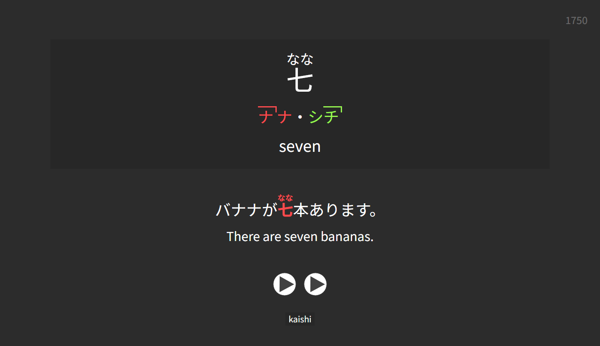

 
  
# Mezashi

A minimalistic Anki note type, based on [Lapis](https://github.com/donkuri/lapis),
[JP-study](https://github.com/rudnam/JP-study), and [Kaishi](https://github.com/donkuri/Kaishi).

 

## About

Mezashi supports card creation via [Yomitan](https://yomitan.wiki), as well as importing cards from
[Kaishi](https://github.com/donkuri/Kaishi).

## Yomitan Field Setup

| Field               | Value                                             |
|---------------------|---------------------------------------------------|
| Expression          | `{expression}`                                    |
| Expression Furigana | `{furigana-plain}`                                |
| Expression Reading  | `{reading}`                                       |
| Accent Nuclei       | `{pitch-accent-positions}` or `{accent-nuclei}`   |
| Expression Note     | `{popup-selection-text}` (optional)               |
| Expression Audio    | `{audio}`                                         |
| Frequency           | `{frequency-harmonic-rank}`                       |
| Sentence            | `{cloze-prefix}<b>{cloze-body}</b>{cloze-suffix}` |
| Sentence Furigana   | (do not use Yomitan to generate furigana!)        |
| Sentence Note       |                                                   |
| Sentence Audio      |                                                   |
| Hint                |                                                   |
| Primary Definition  | `{single-glossary-...}` (select from dropdown)    |
| Glossary            | `{glossary}`                                      |
| Notes               |                                                   |

## Kaishi Import

After importing cards from Kaishi, add a `kaishi` tag to each imported card to enable pronunciation
guide generation.
